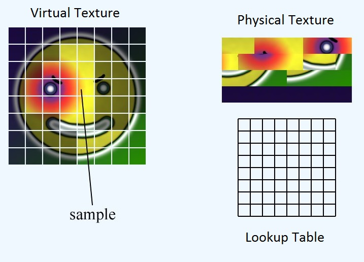

# WGPU Virtual Texturing

This is an experimental project which aims at making a Virtual Texturing System with the `wgpu` library in rust.

### **What is Virtual Texturing?**

Virtual Texturing tries to solve the issue of sampling massive textures on the GPU. Nowadays, game worlds are huge, and require
a ton of texture data. Game developers can solve this issue by using repetitive textures where possible (e.g. repetitive bump maps),
which lowers the memory cost on the gpu. This means that artists can't use their full potential to create game objects, because they need
to respect GPU constraints. Virtual Texturing solves this issue by making use of partially resident textures
(akin to [Virtual Memory](https://en.wikipedia.org/wiki/Virtual_memory)). This is best represented by the following image:

As can be seen, the "virtual" texture is only partly uploaded to the GPU and constitutes the "physical" texture.

### Terminology

Virtual texture: The big texture that can't be loaded all at once on the GPU.
Physical texture: A texture built every frame that lives on the GPU. It is the required part of the virtual texture.

## Texture Streaming

Texture streaming is needed to load parts of the virtual texture from the disk to be stored on the GPU.

**Tradeoffs:**
- Textures are stored with padding, to avoid padding calculation each load.
- Texture Texels are stored as `Rgba8UnormSrgb`

## Sources
- [Virtual Texture Paper 2012](https://www.mrelusive.com/publications/papers/Software-Virtual-Textures.pdf)
- [Virtual Texture Thesis 2010](https://www.cg.tuwien.ac.at/research/publications/2010/Mayer-2010-VT/Mayer-2010-VT-Thesis.pdf)
- [Virtual Textures Website Sean Barret](https://silverspaceship.com/src/svt/)
- [Virtual Textures Video Sean Barret](https://www.youtube.com/watch?v=MejJL87yNgI)
- [Stack Exchange Discussion](https://computergraphics.stackexchange.com/questions/1768/how-can-virtual-texturing-actually-be-efficient)
- [Sparse virtual texturing blog](http://holger.dammertz.org/stuff/notes_VirtualTexturing.html)
